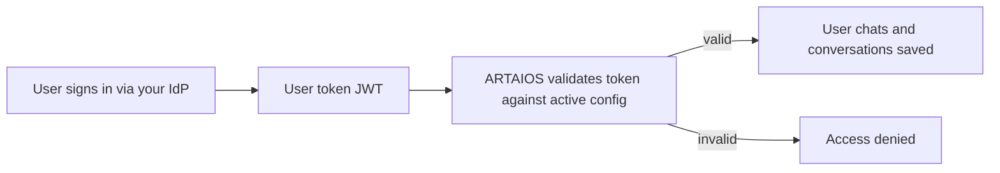

External Auth lets you connect your own identity provider (IdP) to ARTAIOS so that **signed-in users** can use your public chatbots. When a user chats, their token (JWT) is validated against the sign-in system you configure here. Each configuration is scoped to your company and can be reused across multiple agents.

<Frame>
  
</Frame>

## When to Use External Auth

- You enabled **Public Access** on an agent and chose **Signed-in users only**.
- You want only verified users from your identity provider (for example Microsoft Entra ID or any OpenID Connect provider) to chat.
- You want each user's conversations saved to their personal Library.

<Info>
You select a configured sign-in system per agent in the agent's **General** settings. See [Agent Management](/documentation/studio/my-agents#agent-settings).
</Info>

## How It Works

Configurations are **immutable and versioned**:

- Saving changes never edits an existing version — it creates a **new version** and re-points the active one.
- You can **roll back** or **fast-forward** by activating any previous version.
- Secrets (such as a static public key) are **write-only**: they must be re-entered when creating a new version.



## Creating a Sign-in System

<Steps>
  <Step title="Open External Auth Setup">
    Go to **Settings** and open **External Auth Config** (also reachable via **Configure External Auth Setup** from an agent's General tab).
  </Step>

  <Step title="Create a new setup">
    Click **New Setup** and provide:
    - **Name**: A recognizable label (e.g. "Acme SSO (Entra ID)"). This name appears in the agent's public chatbot settings.
    - **Description** (optional): Who signs in with this provider and where it's used.

    <Frame>
      
    </Frame>

  </Step>

  <Step title="Add a configuration version">
    With the setup selected, click **Add Configuration** and choose a **Validation Type** (see below).

    <Frame>
      
    </Frame>

  </Step>

  <Step title="Save">
    Click **Save New Version**. The new version becomes the **active** configuration immediately.
    <Check>The setup shows an active version label and the validation type you selected.</Check>
  </Step>
</Steps>

## Validation Types

Choose how tokens are verified. Only the fields relevant to the selected type are shown.

<Tabs>
  <Tab title="OIDC Discovery">
    Uses the provider's well-known discovery document to locate signing keys automatically.

    <ParamField path="Discovery URL" type="url" required>
      The OpenID configuration endpoint, e.g. `https://issuer/.well-known/openid-configuration`.
    </ParamField>
  </Tab>

  <Tab title="JWKS URL">
    Fetches signing keys directly from a JWKS endpoint.

    <ParamField path="JWKS URL" type="url" required>
      The JSON Web Key Set endpoint, e.g. `https://issuer/.well-known/jwks.json`.
    </ParamField>
  </Tab>

  <Tab title="Public Key URL">
    Fetches a public key from a custom endpoint.

    <ParamField path="Public Key URL" type="url" required>
      The endpoint serving the public key, e.g. `https://issuer/keys`.
    </ParamField>
    <ParamField path="Public Key JSON Path" type="string">
      Optional dotted path used to extract the public key from the JSON response.

      **Supported syntax:**
      - **Object properties**: `field.subfield`
      - **Array indices**: `field[0]`, `field[1]`
      - **Root-level arrays**: `[0]`, `[1]`

      **Examples:**

      <CodeGroup>
        ```json Object Property
        // JSON Response
        {
          "keys": {
            "public": "-----BEGIN PUBLIC KEY-----..."
          }
        }

        // Path
        keys.public
        ```

        ```json Array Index
        // JSON Response
        {
          "keys": [
            {
              "public": "-----BEGIN PUBLIC KEY-----..."
            }
          ]
        }

        // Path
        keys[0].public
        ```

        ```json Root Array
        // JSON Response
        [
          {
            "public": "-----BEGIN PUBLIC KEY-----..."
          }
        ]

        // Path
        [0].public
        ```
      </CodeGroup>
    </ParamField>
  </Tab>

  <Tab title="Static Public Key">
    Validates tokens against a fixed PEM key you paste in.

    <ParamField path="Static Public Key (PEM)" type="string" required>
      The PEM-encoded public key, starting with `-----BEGIN PUBLIC KEY-----`.
    </ParamField>
  </Tab>
</Tabs>

### Common Fields

These optional fields apply to every validation type:

<ParamField path="Issuer" type="string">
  Expected `iss` claim. When set, tokens with a different issuer are rejected.
</ParamField>
<ParamField path="Audience" type="string">
  Expected `aud` claim. When set, tokens with a different audience are rejected.
</ParamField>

### Advanced Settings

<ParamField path="User Identifier Claim" type="string" default="sub">
  The claim used to identify the user (for example `sub` or `email`).
</ParamField>
<ParamField path="Allowed Algorithms" type="array">
  Comma-separated list of accepted signing algorithms (for example `RS256`). Sensible defaults are applied per validation type.
</ParamField>
<ParamField path="Enforced Required Claims" type="array">
  Comma-separated claims (other than the user identifier) that MUST be present in the token for validation to succeed (for example `email, roles`).
</ParamField>

## Managing Versions

<Frame>
  
</Frame>


- **Version History** lists every saved configuration with its validation type, creation time, and author.
- The **active** version is highlighted and is the one used to validate tokens.
- Open a version to **view its details** and **Activate** it to roll back or fast-forward.

<Note>
Activating an older version takes effect immediately for all agents using this setup.
</Note>

## Testing a Configuration

Before relying on a configuration, validate a real token against it.

<Frame>
  
</Frame>


<Steps>
  <Step title="Select a version">
    Choose which version to test against (the active one is marked).
  </Step>
  <Step title="Paste a JWT">
    Paste a token issued by your identity provider.
  </Step>
  <Step title="Run the test">
    Click **Test Token**. The result shows whether the token is valid, any validation errors, the resolved **user identifier**, and the decoded claims.
    <Check>A valid token returns "Token is valid" with the expected user identifier.</Check>
  </Step>
</Steps>

## Connecting to an Agent

<Steps>
  <Step title="Open the agent's General settings">
    In **Agent Management**, open **Settings** and go to the **General** tab.
  </Step>
  <Step title="Enable public access">
    Turn on **Public Access** and provide an **Allowed Origin URL**.
  </Step>
  <Step title="Require sign-in">
    Under **Who can use the chatbot?**, choose **Signed-in users only**.
  </Step>
  <Step title="Select the sign-in system">
    Pick the External Auth configuration you created from the **Sign-in system** dropdown, then save.
  </Step>
</Steps>

<Info>
See [Agent Management → General](/documentation/studio/my-agents#agent-settings) for the agent-side configuration.
</Info>

## Deleting a Setup

Deleting a setup removes it and all of its config versions. Agents using it will no longer be able to authenticate external tokens.

<Warning>
Deletion cannot be undone. Make sure no public agent depends on the setup before deleting it.
</Warning>

## What's Next?

<CardGroup cols={2}>
  <Card title="Agent Management" icon="robot" href="/documentation/studio/my-agents">
    Configure public access and sign-in per agent
  </Card>

  <Card title="Settings" icon="key" href="/documentation/studio/settings">
    Manage API keys and OAuth integrations
  </Card>

  <Card title="Embedding Agents" icon="code" href="/documentation/integration/embedding-agents">
    Add agents to your website
  </Card>

  <Card title="REST API Tutorial" icon="plug" href="/documentation/integration/rest-api-tutorial">
    Connect your agents to applications
  </Card>
</CardGroup>
